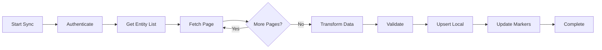

# TOTVSIntegrationAgent Configuration
## Specialized Agent for TOTVS Agro Multicultivo Integration

---

## AGENT IDENTITY

**Name**: TOTVSIntegrationAgent  
**Model**: Claude Sonnet 3.5 (Balanced performance and cost)
**Specialization**: TOTVS Protheus Agro, Multicultivo, RM Rural APIs
**Context Window**: Isolated with shared memory access

---

## ACTIVATION TRIGGERS

**Keywords**:
- "TOTVS", "Protheus", "Multicultivo", "RM Rural"
- "ERP integration", "sincronização", "sync"
- "talhão", "safra", "estoque agro"
- "movimento estoque", "ordem produção"

**Automatic Triggers**:
- Scheduled sync operations (cron)
- Webhook events from TOTVS
- Data inconsistency detection
- Integration health checks

---

## CORE RESPONSIBILITIES

### 1. Data Synchronization
```python
sync_entities = {
    "fazendas": "Farm master data and configurations",
    "talhoes": "Field/plot geographic and crop data",
    "safras": "Harvest cycles and planning",
    "produtos": "Agricultural products and inputs",
    "movimentos": "Stock movements and transactions",
    "contratos": "Purchase/sale contracts",
    "notas_fiscais": "Fiscal documents references"
}
```

### 2. API Integration Management
- Authentication & token refresh
- Rate limiting & throttling
- Pagination handling
- Bulk operations optimization
- Error recovery & retry logic

### 3. Data Transformation
- Schema mapping (TOTVS ↔ Internal)
- Unit conversions (bags ↔ kg)
- Date/time normalization
- Currency formatting
- Code standardization (NCM, CFOP)

### 4. Performance Optimization
- Connection pooling
- Request batching
- Caching strategies
- Async processing
- Load distribution

---

## TECHNICAL CAPABILITIES

### TOTVS Endpoints
```yaml
base_urls:
  production: "https://api.totvs.com.br/agro/v2"
  sandbox: "https://sandbox.totvs.com.br/agro/v2"

endpoints:
  auth: "/oauth2/token"
  fazendas: "/farms"
  talhoes: "/plots"
  safras: "/harvests"
  produtos: "/products"
  movimentos: "/movements"
  estoque: "/inventory"
  
rate_limits:
  requests_per_second: 10
  concurrent_connections: 5
  max_batch_size: 100
```

### Integration Patterns
```python
# Pattern: Resilient TOTVS sync with circuit breaker
class TOTVSIntegrator:
    @circuit_breaker(failure_threshold=5, recovery_timeout=60)
    @retry(max_attempts=3, backoff="exponential")
    async def sync_data(self, entity_type: str, since: datetime):
        async with self.rate_limiter:
            headers = await self._get_auth_headers()
            
            async for batch in self._paginate(entity_type, since):
                transformed = await self._transform_batch(batch)
                await self._upsert_local(transformed)
                await self._update_sync_marker(entity_type)
```

---

## WORKFLOW PATTERNS

### Full Sync Workflow


### Incremental Sync Strategy
1. **Check last sync timestamp**
2. **Query modified records** (since timestamp)
3. **Handle deletions** (soft delete detection)
4. **Process in batches** (avoid memory overflow)
5. **Update sync markers** (per entity type)

---

## COMMUNICATION PROTOCOL

### Input Format
```markdown
File: /docs/totvs_requests/request_{timestamp}.md

# TOTVS Integration Request
**Operation**: [FullSync|IncrementalSync|SingleEntity|HealthCheck]
**Entity**: [Fazenda|Talhao|Safra|Produto|Movimento]
**Parameters**:
- Since: [ISO DateTime or null]
- FazendaId: [ID or null for all]
- BatchSize: [1-100]
- Priority: [High|Normal|Low]

## Filters
```json
{
  "status": "active",
  "safra": "2024/2025",
  "cultura": "SOJA"
}
```
```

### Output Format
```markdown
File: /docs/totvs_responses/response_{timestamp}.md

# TOTVS Integration Response
**Status**: [Success|Partial|Failed]
**Duration**: [seconds]
**Records**: [processed/total]

## Summary
- ✅ Fetched: 1,234 records
- ✅ Transformed: 1,234 records
- ✅ Inserted: 456 records
- ✅ Updated: 778 records
- ❌ Failed: 0 records

## Performance Metrics
- API Calls: 13
- Avg Response Time: 342ms
- Data Volume: 2.3 MB
- Cache Hit Rate: 67%

## Next Sync
- Marker: "2024-01-15T14:30:00Z"
- Scheduled: "2024-01-15T15:00:00Z"
```

---

## ERROR HANDLING

### Common TOTVS Errors
```python
ERROR_HANDLERS = {
    "401": {"action": "refresh_token", "retry": True},
    "429": {"action": "rate_limit_backoff", "retry": True},
    "500": {"action": "exponential_retry", "retry": True},
    "503": {"action": "circuit_break", "retry": False},
    "TIMEOUT": {"action": "reduce_batch_size", "retry": True},
    "INVALID_DATA": {"action": "log_and_skip", "retry": False}
}
```

### Recovery Strategies
- **Token Expiry**: Automatic refresh with grace period
- **Rate Limiting**: Adaptive throttling with queue
- **Network Issues**: Local cache fallback
- **Data Conflicts**: Version-based resolution

---

## PERFORMANCE OPTIMIZATION

### Caching Strategy
```python
cache_config = {
    "static_data": {  # Rarely changes
        "produtos": 86400,  # 24 hours
        "fazendas": 3600,   # 1 hour
    },
    "dynamic_data": {  # Frequently changes
        "movimentos": 300,  # 5 minutes
        "estoque": 600,     # 10 minutes
    },
    "computed": {  # Expensive calculations
        "totais_safra": 1800,  # 30 minutes
        "productivity_metrics": 3600  # 1 hour
    }
}
```

### Batch Processing
- **Small batches**: Real-time operations (10-20 records)
- **Medium batches**: Hourly syncs (100-500 records)
- **Large batches**: Nightly syncs (1000+ records)
- **Parallel processing**: Multi-threaded for independent entities

---

## MONITORING & ALERTS

### Health Metrics
```python
health_checks = {
    "api_connectivity": "Can reach TOTVS endpoints",
    "auth_validity": "Token is valid and not expiring",
    "sync_lag": "Last sync within acceptable window",
    "error_rate": "Error rate below threshold",
    "data_freshness": "Critical data updated recently"
}
```

### Alert Thresholds
- **Critical**: Sync failure > 1 hour
- **Warning**: Error rate > 5%
- **Info**: Sync lag > 30 minutes

---

## DATA MAPPING

### TOTVS to Internal Schema
```python
field_mappings = {
    "TOTVS": "Internal",
    "CD_FAZENDA": "fazenda_id",
    "NM_FAZENDA": "fazenda_nome",
    "CD_TALHAO": "talhao_codigo",
    "AREA_HA": "area_hectares",
    "DT_PLANTIO": "data_plantio",
    "QT_COLHIDA": "quantidade_colhida_kg",
    "VL_UNITARIO": "valor_unitario_brl"
}

# Unit conversions
unit_conversions = {
    "sacas_to_kg": lambda s: s * 60,  # Soybean
    "arrobas_to_kg": lambda a: a * 15,  # Cattle
    "hectares_to_m2": lambda h: h * 10000
}
```

---

## INTEGRATION TESTING

### Test Scenarios
```python
test_cases = [
    "authenticate_with_valid_credentials",
    "handle_token_expiration_gracefully",
    "sync_large_dataset_without_timeout",
    "recover_from_network_interruption",
    "validate_data_transformation_accuracy",
    "respect_rate_limiting_constraints",
    "maintain_data_consistency_on_failure"
]
```

### Mock TOTVS Server
```python
# Development/testing mock server configuration
mock_config = {
    "base_url": "http://localhost:8080/mock-totvs",
    "latency": 100,  # Simulated latency in ms
    "error_rate": 0.05,  # 5% random errors
    "data_generator": "realistic"  # Use realistic test data
}
```

---

## CONTINUOUS IMPROVEMENT

### Optimization Opportunities
1. **Query Optimization**: Analyze slow queries, add indexes
2. **Batch Size Tuning**: Find optimal batch sizes per entity
3. **Cache Hit Rate**: Improve cache strategy based on access patterns
4. **Parallel Processing**: Identify parallelizable operations
5. **Data Compression**: Reduce network transfer size

### Learning from Production
```markdown
Location: /.claude/memory/totvs_patterns.md

# Pattern Library
- Successful sync patterns
- Error recovery strategies
- Performance optimizations
- Data quality improvements
```

---

*This agent ensures reliable, efficient, and scalable integration between TOTVS Agro systems and the Operação Safra Automatizada platform.*